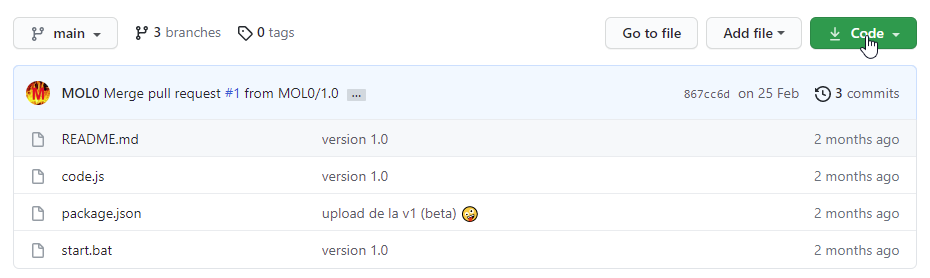
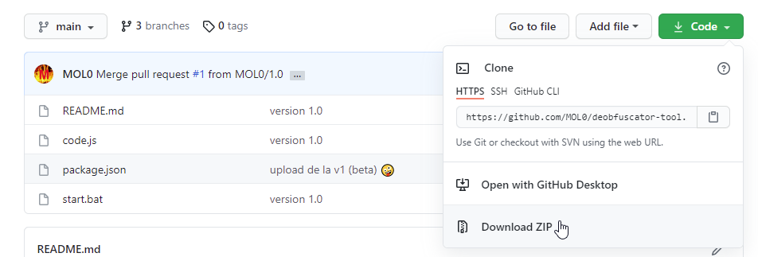
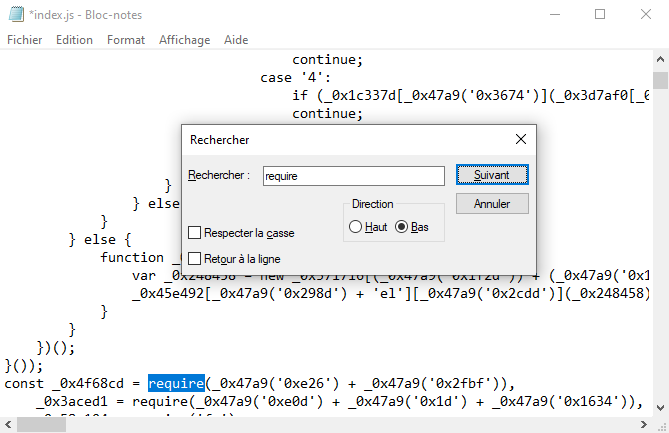
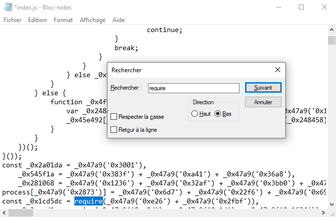
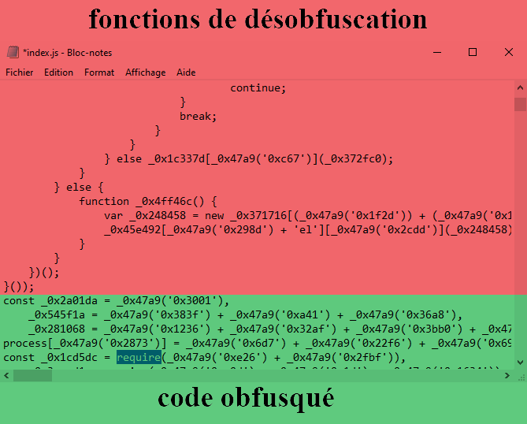
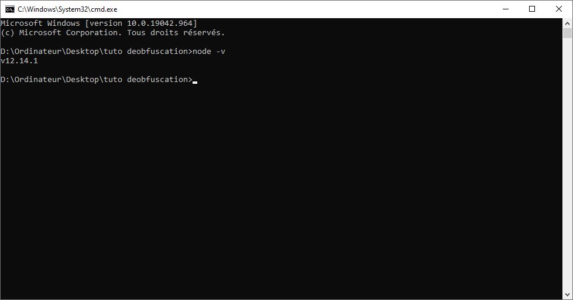

# deobfuscator tool v1.1 by molo
## changelog
bah j'avais oublié un \ dcp ça remplaçait `\u0022` par `"` au lieu de remplacer par `\"`  
aussi j'ai update le readme xd  
## installation
Cliquez simplement sur le bouton Code comme sur le screen  
  
puis sur Download ZIP.  
  
Ensuite vous n'avez plus qu'à extraire le zip sur votre bureau par exemple.  
## utilisation
**1** allez dans le dossier que vous venez d'extraire et copiez le fichier `code.js`  
**2** collez le dans le dossier où se trouve le fichier que vous voulez deob  
**3** ouvrez le fichier que vous voulez deob, copiez tout le code et utilisez https://beautifier.io/ pour obtenir une version à moitié deob  
La version que vous venez d'obtenir n'est pas totalement deob mais déjà plus lisible. Elle va nous servir pour trouver les fonctions de désobfuscation.  
**4** pensez à remplacer le contenu du fichier à deob  
**5** c'est la que ça se complique... il va nous falloir les fonctions de désobfuscation  
**5.1** ouvrez le fichier à deob avec un éditeur de texte de votre choix.  
**5.2** ensuite, faites ctrl + f  
**5.3** tapez `require`  
**5.4** recherchez la première occurence, cela devrez vous donner quelque chose comme ça :  
  
**5.5.a** si vous avez un résultat similaire, copiez tout ce qu'il y a AVANT `const _0x1234 = require(...)` et collez le dans code.js  
**5.5.b** si votre résultat ressemble plutôt à ça :  
  
ce n'est pas grave, c'est juste que vos fonctions de désobfuscation se trouvent à un autre endroit
  
copiez donc les fonctions de désobfuscation (en rouge) et collez les dans code.js  
si vous n'avez toujours pas compris contactez moi sur discord (molo#7947)  
**6** ouvrez cmd dans ce dossier (ouvrez cmd et faites `cd C:/dossier` ou `cd /d X:/dossier`)  
**7** faites `node -v` et vérifiez que votre version est bien supérieure à la v12 (comme sur le screen)  
  
ATTENTION : si votre version est inférieure à la v12 ou que vous avez une erreur il faut réinstaller node.  
(pour cela allez sur https://nodejs.org/en/ et choisissez une des deux versions)  
**8** pour terminer, il ne vous reste plus qu'à faire `node code "fichier.js"` pour deob le fichier (pensez évidemment à mettre le nom du fichier à la place de fichier.js)  
**8.1** vous pouvez aussi écrire `node code "2" "_0x1234[_0x5678(9)]"` pour ne pas deob tout le fichier  
**9** si vous avez une erreur "Allocation failed - JavaScript heap out of memory" ou qu'il ne se passe rien c'est que les presets de l'obfuscation sont trop élevés (donc impossible de deob si vous n'avez pas un minimum d'expérience)  
**10** si tout se passe bien, le fichier à deob va être modifié et vous n'aurez plus qu'à l'ouvrir de nouveau pour accéder au contenu désobfusqué
